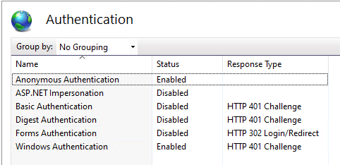

# IIS

Pode has support for you to host your server via IIS!

When you host your server through IIS, Pode will detect this and internally set the server type and endpoints to automatically work with IIS. This allows IIS to deal with binding, HTTPS and Certificates, as well as external traffic, etc.

!!! important
    This being IIS, it is for Windows only!

## Requirements

To start with you'll need to have IIS (or IIS Express) installed:

```powershell
Install-WindowsFeature -Name Web-Server -IncludeManagementTools -IncludeAllSubFeature
```

At a minimum for IIS you need the following installed:

```powershell
$features = @(
    'Web-Default-Doc',
    'Web-Dir-Browsing',
    'Web-Http-Errors',
    'Web-Static-Content',
    'Web-Http-Redirect',
    'Web-DAV-Publishing',
    'Web-Http-Logging',
    'Web-Stat-Compression',
    'Web-Filtering',
    'Web-Net-Ext',
    'Web-Net-Ext45',
    'Web-Asp-Net',
    'Web-Asp-Net45',
    'Web-CGI',
    'Web-ISAPI-Ext',
    'Web-ISAPI-Filter',
    'Web-Mgmt-Console'
)

$features | ForEach-Object { Install-WindowsFeature -Name $_ }
```

If you need to use Basic or Windows Authentication in IIS then you'll need either `Web-Basic-Auth` or `Web-Windows-Auth` respectively. If you're using WebSockets in Pode then you'll also need `Web-WebSockets`.

Next you'll need to install [ASP.NET Core Windows hosting](https://download.visualstudio.microsoft.com/download/pr/c887d56b-4667-4e1d-9b6c-95a32dd65622/97e3eef489af8a6950744c4f9bde73c0/dotnet-hosting-5.0.8-win.exe):

```powershell
choco install dotnet-windowshosting -y
```

You'll also need to use [PowerShell Core](https://github.com/PowerShell/PowerShell/releases/latest) (*not Windows PowerShell!*):

```powershell
choco install pwsh -y
```

Finally, you'll need to have Pode installed under PowerShell Core:

```powershell
pwsh -c "Install-Module Pode -Scope AllUsers"
```

!!! note
    Sometimes you may need to run `iisreset` (or restart the computer) after installing all of the above, otherwise IIS will return 502 errors.

## Configuration

The first thing you'll need to do so IIS can host your server is, in the same directory as your Pode server's `.ps1` root script, create a `web.config` file. This file should look as follows, but make sure you replace the `.\server.ps1` with the path to your actual server script:

```xml
<configuration>
  <location path="." inheritInChildApplications="false">
    <system.webServer>
      <handlers>
        <remove name="WebDAV" />
        <add name="aspNetCore" path="*" verb="*" modules="AspNetCoreModuleV2" resourceType="Unspecified" />
        <remove name="ExtensionlessUrlHandler-Integrated-4.0" />
        <add name="ExtensionlessUrlHandler-Integrated-4.0" path="*." verb="*" type="System.Web.Handlers.TransferRequestHandler" preCondition="integratedMode,runtimeVersionv4.0" />
        <remove name="ExtensionlessUrl-Integrated-4.0" />
        <add name="ExtensionlessUrl-Integrated-4.0" path="*." verb="*" type="System.Web.Handlers.TransferRequestHandler" preCondition="integratedMode,runtimeVersionv4.0" />
      </handlers>

      <modules>
        <remove name="WebDAVModule" />
      </modules>

      <aspNetCore processPath="pwsh.exe" arguments=".\server.ps1" stdoutLogEnabled="true" stdoutLogFile=".\logs\stdout" hostingModel="OutOfProcess"/>

      <security>
        <authorization>
          <remove users="*" roles="" verbs="" />
          <add accessType="Allow" users="*" verbs="GET,HEAD,POST,PUT,DELETE,DEBUG,OPTIONS" />
        </authorization>
      </security>
    </system.webServer>
  </location>
</configuration>
```

### PowerShell Permissions

Ensure IIS has access to the `pwsh.exe` processPath referenced in the `web.config` file above. If IIS doesn't have access, you'll see the `HTTP Error 502.5 - ANCM Out-Of-Process Startup Failure` error page.

If IIS doesn't have access to the whole path, you can either:

* Grant the user running your IIS application pool (or website) access to the path and `pwsh.exe`, or
* Install a standalone version of the `pwsh.exe` from the [PowerShell GitHub](https://github.com/PowerShell/PowerShell/releases), and into a path IIS can access.

!!! tip
    If you installed PowerShell via the Microsoft Store, and the `pwsh.exe` is under the `WindowsApps` directory path, then IIS won't have access. Because this is WindowsApp, the recommended solution is to install a standalone `pwsh.exe` from the [PowerShell GitHub](https://github.com/PowerShell/PowerShell/releases), and use that path as the processPath in your `web.config`.

## IIS Setup

With the `web.config` file in place, it's then time to setup the site in IIS. The first thing to do is open up the IIS Manager, then once open, follow the below steps to setup your site:

1. In the left pane, expand the Server and then the Sites folders
2. Right click the "Application Pools" folder
    1. Enter a name for your Application Pool, just the name of your site will do, such as "pode.example.com"
    2. Select OK to create the Application Pool
3. Right click the Sites folder, and select "Add Website..."
    1. Enter the name of your website, such as "pode.example.com"
    2. Select the Application Pool that we created above
    3. Set the Physical Path to the root directory of your Pode server's script (just the directory, not the ps1 itself)
    4. Select either HTTP or HTTPS for your binding
        i. If you're using WS or WSS, still select either HTTP or HTTPS respectively
    5. Leave IP Address as "All Unassigned", and either leave the Port as 80/443 or change to what you need
    6. Optionally enter the host name of your site, such as "pode.example.com" (usually required for HTTPS)
    7. If HTTPS, select "Require SNI"
    8. If HTTPS, select the required certificate from the dropdown
    9. Select OK to create the Site

At this point, your site is now created in IIS, and you should be able to navigate to the hostname/IP and port combination you setup above for the IIS site. Pode automatically detects that it is running via IIS, and it changes certain attributes of your Pode server so they work with IIS:

* Endpoints have their Address set to `127.0.0.1` (IIS needs Pode to be on localhost)
* Endpoints have their Port set to `ASPNETCORE_PORT`
* Endpoints have their Protocol set to `HTTP` or `WS` (IIS deals with HTTPS/WSS for us)

This allows you to write a Pode server that works locally, but will also automatically work under IIS without having to change anything!

!!! note
    This does mean that Pode will force all endpoints to `127.0.0.1:PORT`. So if you had two different IPs before, they'll be merged into one. Something to be aware of if you assign routes to specific endpoints, as under IIS this won't work.

### Maximum Worker Processes

Unless you're using an external data store for sessions, ensure the Maximum Worker Processes is 1. Each worker process will spawn a new instance of your Pode server, and if using Pode's inbuilt session storage you'll face authenticated/session timeout issues when one instance doesn't contain the right session.

### Advanced/Domain/Kerberos

The above IIS site setup works, but only for simple sites. If you require the use of the Active Directory module, or your site to be running as a different user then follow the steps below.

#### Active Directory

By default a newly created site will be running as ApplicationPoolIdentity. In order to use the Active Directory module, your IIS site will need to be running as a domain user:

1. Open IIS, and select the Application Pools folder
2. Right click your Application Pool, and select "Advanced Settings..."
3. Under "Process Module", click the "..." of the "Identity" setting
4. Select "Custom account", and change the account to the credentials of a valid domain user
5. Select OK

If you've enabled Basic authentication in IIS for you site, you'll also need to edit the domain there as well:

1. Open IIS, and expand the Sites folder
2. Select your Site
3. In the middle pane, under IIS, select "Authentication"
4. Right click "Basic Authentication" (if it's enabled)
5. Edit the domain to your domain
6. Select OK

Sometimes you might run into issues using the Active Directory module under IIS - such as the following error:

```plain
Creating a new session for implicit remoting of "Get-ADUser" command...
```

If this happens, you'll need to make your AD calls using `Invoke-Command`:

```powershell
Invoke-Command -ArgumentList $username -ScriptBlock {
    param($username)
    Import-Module -Name ActiveDirectory
    Get-ADUser -Identity $username
}
```

#### Change User

To change the user your site is running as:

1. Open IIS, and select the Application Pools folder
2. Right click your Application Pool, and select "Advanced Settings..."
3. Under "Process Module", click the "..." of the "Identity" setting
4. Change the user to either an inbuilt one, or a custom local/domain user
5. Select OK

## IIS Application

You can host your Pode server as an Application under another Website in IIS by doing the following:

1. In IIS, right click the Website
2. Select "Add Application..."
3. Enter a name for your Application under "Alias"
4. Set the Physical Path to the root directory of your Pode server's script (just the directory, not the ps1 itself)
5. Select OK

The website will be available at the same binding(s) as the main website, but the URL will need `/<alias>` appended.

For example, if the website has the binding `http://localhost:8080` and the alias of the application is `api`, then you can access the application at `http://localhost:8080/api`.

The server will get a URL path of `/api/etc`, but you can keep your route paths as `/etc`, as Pode will automatically remove the `/api` from `/api/etc`. This lets you host the same server under any alias name.

## HTTPS/WSS

Although Pode does have support for HTTPS/WSS, when running via IIS it takes control of HTTPS/WSS for us - this is why the endpoints are forced to HTTP/WS.

You can setup a binding in IIS for HTTPS (still HTTPS for WSS) with a Certificate, and IIS will deal with SSL for you:

1. Open IIS, and expand the Sites folder
2. Right click your Site, and select "Edit Bindings..."
3. Select "Add..."
4. Select HTTPS for your binding (even if your endpoint in WSS)
5. Leave IP Address as "All Unassigned", and either leave the Port as 443 or change to what you need
6. Enter the host name of your site, such as "pode.example.com"
7. Select "Require SNI"
8. Select the required certificate from the dropdown
9. Select OK to create the Binding

## Recycling

By default, IIS has certain settings that will recycle/shutdown your Application Pools. This will cause some requests to "spin-up" the site for the first time, and go slow.

To help prevent this, below are some of the common setting that can be altered to stop IIS recycling/shutting down your site:

1. Open IIS, and select the Application Pools folder
2. Right click your Application Pool, and select "Advanced Settings..."
3. Under "Process Model", to stop IIS shutting down your site
    1. Set the "Idle Time-out" to 0
4. Under "Recycling", to stop IIS recycling your site
    1. Set the "Regular Time Interval" to 0
    2. Remove all times from "Specific Times"

This isn't bulletproof, and IIS can sometimes restart your site if it feels like it. Also make sure that there are no periodic processes anywhere that might recycle Application Pools, or run `iisreset`.

When IIS does restart your site, the log file should show the usual Pode "Terminating" message, but preceded with "(IIS Shutdown)".

### Debug Line

Whenever IIS recycles/shuts down your site, you may see a debug line in your logs if the initial HTTP shutdown request fails, such as:

```plain
Entering debug mode. Use h or ? for help.

At C:\Program Files\PowerShell\Modules\Pode\2.0.3\Public\Core.ps1:176 char:13
+ $key = Get-PodeConsoleKey
+ ~~~~~~~~~~~~~~~~~~~~~~~~~
[DBG]: PS D:\wwwroot\sitename>>
```

This is nothing to worry about, and is purely just IIS terminating the PowerShell runspace to shutdown the Application Pool.

## ASP.NET Token

When hosted via IIS, Pode inspects every request to make sure the mandatory `MS-ASPNETCORE-TOKEN` header is present. This is a token supplied by IIS, and if it's missing Pode will reject the request with a 400 response.

There's nothing you need to do, IIS informs Pode about the token for you, and IIS will add the header to the requests automatically for you as well.

## IIS Authentication

If you decide to use IIS for Windows Authentication, then you can retrieve the authenticated user in Pode. This is done using the [`Add-PodeAuthIIS`](../../Functions/Authentication/Add-PodeAuthIIS) function, and it will check for the `MS-ASPNETCORE-WINAUTHTOKEN` header from IIS. The function creates a custom Authentication Type and Method, and can be used on Routes like other authentications in Pode:

```powershell
Start-PodeServer {
    Add-PodeEndpoint -Address 127.0.0.1 -Protocol Http

    Enable-PodeSessionMiddleware -Duration 120 -Extend
    Add-PodeAuthIIS -Name 'IISAuth'

    Add-PodeRoute -Method Get -Path '/test' -Authentication 'IISAuth' -ScriptBlock {
        Write-PodeJsonResponse -Value @{ User = $WebEvent.Auth.User }
    }
}
```

If the required header is missing, then Pode responds with a 401. The retrieved user, like other authentication, is set on the [web event](../../Tutorials/WebEvent)'s `$WebEvent.Auth.User` property, and contains the same information as Pode's inbuilt Windows AD authenticator:

| Name               | Type                                      | Description                                                     |
| ------------------ | ----------------------------------------- | --------------------------------------------------------------- |
| UserType           | string                                    | Specifies if the user is a Domain or Local user                 |
| Identity           | System.Security.Principal.WindowsIdentity | Returns the WindowsIdentity which can be used for Impersonation |
| AuthenticationType | string                                    | Value is fixed to LDAP                                          |
| DistinguishedName  | string                                    | The distinguished name of the user                              |
| Username           | string                                    | The user's username (without domain)                            |
| Name               | string                                    | The user's fullname                                             |
| Email              | string                                    | The user's email address                                        |
| FQDN               | string                                    | The FQDN of the AD server                                       |
| Domain             | string                                    | The domain part of the user's username                          |
| Groups             | string[]                                  | All groups of which the the user is a member                    |

!!! note
    If the authenticated user is a Local User, then the following properties will be empty: FQDN, Email, and DistinguishedName

### Groups

Similar to Windows AD authentication, Pode by default will retrieve all groups that a user is a member of, recursively. This can at times cause performance issues if you have a lot of groups in your domain.

If you need groups, but you only need the direct groups a user is a member of then you can specify `-DirectGroups`. Or, if you don't need the groups at all, you can specify `-NoGroups`:

```powershell
# direct groups only
Add-PodeAuthIIS -Name 'IISAuth' -DirectGroups

# no groups
Add-PodeAuthIIS -Name 'IISAuth' -NoGroups
```

### Client Certificates

You can enable Pode to get client certificates from IIS by passing `-AllowClientCertificate` to your [`Add-PodeEndpoint`](../../Functions/Core/Add-PodeEndpoint). Pode will check for either the `MS-ASPNETCORE-CLIENTCERT` or `X-ARR-ClientCert` headers, and if either is present they'll be used to set the certificate against `$WebEvent.Request.ClientCertificate`.

This also allows for using [Client Certificate](../../Tutorials/Authentication/Methods/ClientCertificate) authentication in Pode, even when behind IIS.

### Additional Validation

Similar to the normal [`Add-PodeAuth`](../../Functions/Authentication/Add-PodeAuth), [`Add-PodeAuthIIS`](../../Functions/Authentication/Add-PodeAuthIIS) can be supplied can an optional ScriptBlock parameter. This ScriptBlock is supplied the found User object as a parameter, structured as details above. You can then use this to further check the user, or load additional user information from another storage.

The ScriptBlock has the same return rules as [`Add-PodeAuth`](../../Functions/Authentication/Add-PodeAuth), as can be seen in the [Overview](../../Tutorials/Authentication/Overview).

For example, to return the user back:

```powershell
Add-PodeAuthIIS -Name 'IISAuth' -ScriptBlock {
    param($user)

    # check or load extra data

    return @{ User = $user }
}
```

Or to fail authentication with an error message:

```powershell
Add-PodeAuthIIS -Name 'IISAuth' -ScriptBlock {
    param($user)
    return @{ Message = 'Authorization failed' }
}
```

## IIS Advanced Kerberos

Kerberos Authentication can be configured using Active Directory account and
Group Managed Service Account (gMSA)

gMSA allows automatic password management, if you have more than 1 IIS server running Pode better to use gMSA for IIS AppPool Identity

### Use case scenario

 - Two Pode servers behind Load Balancer
 - Kerberos Authentication is used to authenticate users (with optional Impersonation)

### Infrastructure setup

Tested on Windows Server 2022

- IIS Server with machine name IIS1$
- IIS Server with machine name IIS2$
- Both VMs behind Load Balancer
- Pode deployed to both IIS servers using documentation
- Pode address https://PodeServer.Contoso.com
- web.config file:
``` xml
<configuration>
  <location path="." inheritInChildApplications="false">
    <system.webServer>
      <validation validateIntegratedModeConfiguration="true" />
      <handlers>
        <remove name="WebDAV" />
        <add name="aspNetCore" path="*" verb="*" modules="AspNetCoreModuleV2" resourceType="Unspecified" />
        <remove name="ExtensionlessUrlHandler-Integrated-4.0" />
        <add name="ExtensionlessUrlHandler-Integrated-4.0" path="*." verb="*" type="System.Web.Handlers.TransferRequestHandler" preCondition="integratedMode,runtimeVersionv4.0" />
        <remove name="ExtensionlessUrl-Integrated-4.0" />
        <add name="ExtensionlessUrl-Integrated-4.0" path="*." verb="*" type="System.Web.Handlers.TransferRequestHandler" preCondition="integratedMode,runtimeVersionv4.0" />
      </handlers>

      <modules>
        <remove name="WebDAVModule" />
      </modules>

      <aspNetCore processPath="pwsh.exe" arguments=".\Pode\server.ps1" stdoutLogEnabled="true" stdoutLogFile=".\Pode\logs\stdout" hostingModel="OutOfProcess" />

      <security>
        <authorization>
          <remove users="*" roles="" verbs="" />
          <add accessType="Allow" users="*" verbs="GET,HEAD,POST,PUT,DELETE,DEBUG,OPTIONS" />
        </authorization>
      </security>
    </system.webServer>
  </location>
    <system.web>
        <identity impersonate="false" />
    </system.web>
</configuration>
```
- Test deployment using **Server.ps1** content:
``` powershell
Import-Module Pode

Start-PodeServer -StatusPageExceptions Show {

    # add a simple endpoint
    Add-PodeEndpoint -Address localhost -Port 8080 -Protocol Http

    # Create IIS Pode authentication method
    Add-PodeAuthIIS -Name 'IISAuth' -Sessionless

    # Test Kerberos authentication
    Add-PodeRoute -Method Get -Path '/test-kerberos' -Authentication 'IISAuth' -ScriptBlock {
        Write-PodeJsonResponse -Value @{ User = $WebEvent.Auth.User }
    }

    # Test Kerberos Impersonation
    Add-PodeRoute -Method Get -Path '/test-kerberos-impersonation' -Authentication 'IISAuth' -ScriptBlock {
        [System.Security.Principal.WindowsIdentity]::RunImpersonated($WebEvent.Auth.User.Identity.AccessToken, {
        $newIdentity = [Security.Principal.WindowsIdentity]::GetCurrent() | Select-Object -ExpandProperty 'Name'
        Write-PodeTextResponse -Value "You are running this command as the server user $newIdentity"
        })
    }

}
```
- IIS Site Authentication settings


### Configuration steps for _Domain Account_:

1. Create Domain Users in AD for Pode AppPool - **Pode.Svc**
1. Create SPNs:
    ``` cmd
    setspn -d HTTP/PodeServer Contoso\pode.svc
    setspn -d HTTP/PodeServer.Contoso.com Contoso\pode.svc
    ```
1. Configure **Pode.Svc** user Delegation - _Trust this user for delegation ..._
1. Configure Pode Website to use **PodeServer.Contoso.com** as **Host Name**
1. Configure Pode Website AppPool to use _Contoso\pode.svc_ as **Identity**
1. Give write permissions to _Contoso\gmsaPodeSvc$_ on *Pode* folder
1. _**!!! Important !!!**_ Add PTR DNS record _PodeServer.Contoso.com_ pointing to Load Balancer IP. If you have only one server and want to test, replace PTR record for _iis1.Contoso.com_ to _PodeServer.Contoso.com_
1. Open URLs:
    - https://PodeServer.Contoso.com/
    - https://PodeServer.Contoso.com/test-kerberos
    - https://PodeServer.Contoso.com/test-kerberos-impersonation

### Configuration steps for _Group Managed Service Account_

1. Create the KDS Root Key (only once per forest).  This is used by the KDS service on DCs (along with other information) to generate passwords. Execute on Domain Controller
    ``` PowerShell
    # Once per domain, effective date -10 hours to start using keys immediately
    Add-KdsRootKey ???EffectiveTime ((get-date).addhours(-10))
    # Force AD Replication
    (Get-ADDomainController -Filter *).Name | Foreach-Object {repadmin /syncall $_ (Get-ADDomain).DistinguishedName /e /A | Out-Null}; Start-Sleep 10; Get-ADReplicationPartnerMetadata -Target "$env:userdnsdomain" -Scope Domain | Select-Object Server, LastReplicationSuccess
    ```
1. Create _Group Managed Service Account_, configure SPNs and Delegation
    ``` PowerShell
    # Create Authorized host group
    New-ADGroup -Name "Pode Authorized Hosts" -SamAccountName "pode.hosts" -GroupScope Global
    # Create gMSA Account
    New-ADServiceAccount -Name "gmsaPodeSvc" -DnsHostName "PodeServer.Contoso.com" `
                        -ServicePrincipalNames "host/PodeServer", "host/PodeServer.Contoso.com","http/PodeServer", "http/PodeServer.Contoso.com" `
                        -PrincipalsAllowedToRetrieveManagedPassword "pode.hosts"
    # Configure for Impersonation
    Set-ADAccountControl -Identity gmsaPodeSvc$ -TrustedForDelegation $true -TrustedToAuthForDelegation $false
    # Add IIS servers to group
    Add-ADGroupMember -Identity "pode.hosts" -Members "iis1$","iis2$"
    # Reboot IIS servers to update hosts group membership!
    Restart-Computer -ComputerName "iis1","iis2" -force
    ```
1. _**!!! Important !!!**_ Both IIS Servers must be rebooted to update Group Membership
1. On both IIS Servers:
    ``` PowerShell
    Add-WindowsFeature RSAT-AD-PowerShell
    Install-ADServiceAccount gmsaPodeSvc
    # Next line should return $True
    Test-ADServiceAccount gmsaPodeSvc
    ```
1. Configure Pode Website to use **PodeServer.Contoso.com** as **Host Name**
1. Configure Pode Website AppPool to use _Contoso\gmsaPodeSvc$_ as **Identity**
1. Give write permissions to _Contoso\gmsaPodeSvc$_ on *Pode* folder
1. _**!!! Important !!!**_ Add PTR DNS record _PodeServer.Contoso.com_ pointing to Load Balancer IP. If you have only one server and want to test, replace PTR record for _iis1.Contoso.com_ to _PodeServer.Contoso.com_
1. Open URLs:
    - https://PodeServer.Contoso.com/
    - https://PodeServer.Contoso.com/test-kerberos
    - https://PodeServer.Contoso.com/test-kerberos-impersonation

### Kerberos Impersonate

Pode can impersonate the user that requests the web page using Kerberos Constrained Delegation (KCD).

Requirements:

* The use of KCD requires additional configuration in Active Directory (read up on PrincipalsAllowedToDelegateToAccount)
* No Session middleware configured (`-Sessionless` switch on authentication setup)

This can be done using the following example:

```powershell
[System.Security.Principal.WindowsIdentity]::RunImpersonated($WebEvent.Auth.User.Identity.AccessToken, {
    $newIdentity = [Security.Principal.WindowsIdentity]::GetCurrent() | Select-Object -ExpandProperty 'Name'
    Write-PodeTextResponse -Value "You are running this command as the server user $newIdentity"
})
```

## Azure Web Apps

To host your Pode server under IIS using Azure Web Apps, ensure the OS type is Windows and the framework is .NET Core 2.1/3.0.

Your web.config's `processPath` will also need to reference `powershell.exe` not `pwsh.exe`.

Pode can auto-detect if you're using an Azure Web App, but if you're having issues trying setting the `-Daemon` switches on your [`Start-PodeServer`](../../Functions/Core/Start-PodeServer).

## Useful Links

* [Host ASP.NET Core on Windows with IIS \| Microsoft Docs](https://docs.microsoft.com/en-us/aspnet/core/host-and-deploy/iis/?view=aspnetcore-3.1)
* [Group Managed Service Accounts \| Microsoft Docs](https://docs.microsoft.com/en-us/windows-server/security/group-managed-service-accounts/group-managed-service-accounts-overview)
* [Kerberos Authentication \| Microsoft Docs](https://docs.microsoft.com/en-us/windows-server/security/kerberos/kerberos-authentication-overview)
