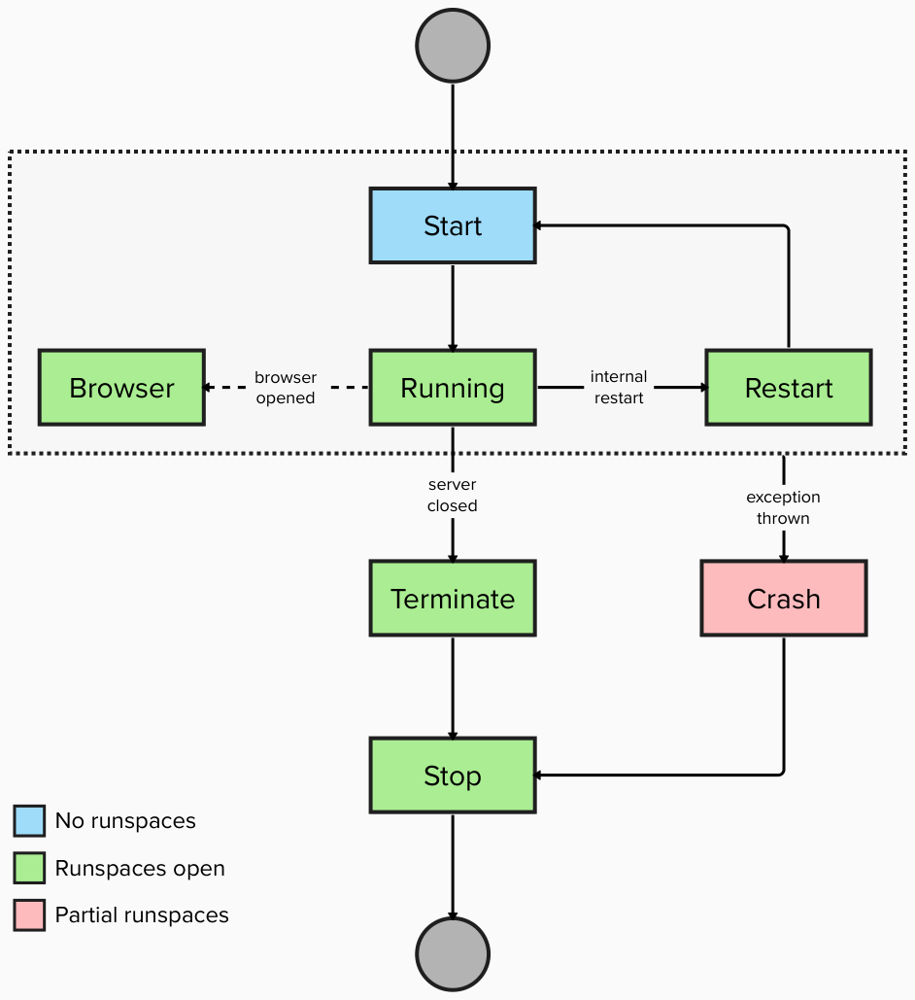

# Events

Pode lets you register scripts to be run when certain server events are triggered. The following types of events can have scripts registered:

* Start
* Starting
* Terminate
* Restarting
* Restart
* Browser
* Crash
* Stop
* Running
* Suspending
* Suspend
* Resume
* Enable
* Disable

And these events are triggered in the following order:



## Overview

You can use [`Register-PodeEvent`](../../Functions/Events/Register-PodeEvent) to register a script that can be run when an event within Pode is triggered. Each event can have multiple scripts registered, and you can unregister a script at any point using [`Unregister-PodeEvent`](../../Functions/Events/Unregister-PodeEvent):

```powershell
# register:
Register-PodeEvent -Type Start -Name '<name>' -ScriptBlock {
    # inform a portal, write a log, etc
}

# unregister:
Unregister-PodeEvent -Type Start -Name '<name>'
```

The scriptblock supplied to `Register-PodeEvent` also supports `$using:` variables. You can retrieve a registered script using [`Get-PodeEvent`](../../Functions/Events/Get-PodeEvent):

```powershell
$evt = Get-PodeEvent -Type Start -Name '<name>'
```

## Types

### Start

Scripts registered to the `Start` event will all be invoked just after the `-ScriptBlock` supplied to [`Start-PodeServer`](../../Functions/Core/Start-PodeServer) has been invoked, and just before the runspaces for Pode have been opened.

If you need the runspaces to be opened, you'll want to look at the `Running` event below.

These scripts will also be re-invoked after a server restart has occurred.

### Starting

Scripts registered to the `Starting` event will all be invoked during the initialization phase of the server, before the `Start` event is triggered.

### Terminate

Scripts registered to the `Terminate` event will all be invoked just before the server terminates. Ie, when the `Terminating...` message usually appears in the terminal, the script will run just after this and just before the `Done` message. Runspaces at this point will still be open.

### Restarting

Scripts registered to the `Restarting` event will all be invoked when the server begins the restart process. This occurs before the `Restart` event.

### Restart

Scripts registered to the `Restart` event will all be invoked whenever an internal server restart occurs. This could be due to file monitoring, auto-restarting, `Ctrl+R`, or [`Restart-PodeServer`](../../Functions/Core/Restart-PodeServer). They will be invoked just after the `Restarting...` message appears in the terminal, and just before the `Done` message. Runspaces at this point will still be open.

### Browser

Scripts registered to the `Browser` event will all be invoked whenever the server is told to open a browser, ie: when `Ctrl+B` is pressed. Runspaces at this point will still be open.

### Crash

Scripts registered to the `Crash` event will all be invoked if the server ever terminates due to an exception being thrown. If a Crash event is triggered, then Terminate will not be triggered. Runspaces at this point will still be open, but there could be a chance not all of them will be available as the crash could have occurred from a runspace error.

### Stop

Scripts registered to the `Stop` event will all be invoked when the server stops and closes. This event will be fired after either the Terminate or Crash events - whichever one causes the server to ultimately stop. Runspaces at this point will still be open.

### Running

Scripts registered to the `Running` event will all be run soon after the `Start` event, even after a `Restart`. At this point all of the runspaces will have been opened and available for use.

### Suspending

Scripts registered to the `Suspending` event will all be invoked when the server begins the suspension process.

### Suspend

Scripts registered to the `Suspend` event will all be invoked when the server completes the suspension process.

### Resume

Scripts registered to the `Resume` event will all be invoked when the server resumes operation after suspension.

### Enable

Scripts registered to the `Enable` event will all be invoked when the server is enabled.

### Disable

Scripts registered to the `Disable` event will all be invoked when the server is disabled.

