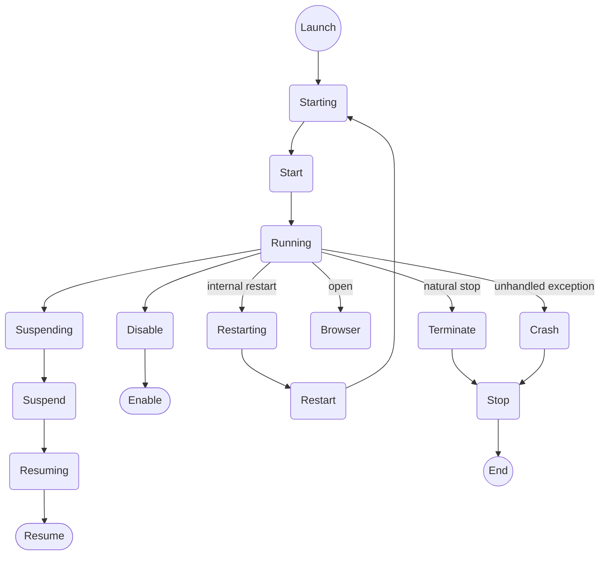

# Events

Pode lets you register scripts to be run when certain server events are triggered. The following types of events can have scripts registered:

| Event      | Description                                                                                        | Runspaces Open? |
| ---------- | -------------------------------------------------------------------------------------------------- | --------------- |
| Starting   | Triggered during the initialization phase of the server, just after configuration has been loaded. | No              |
| Start      | Triggered just after the server's `-ScriptBlock`  has been invoked.                                | No              |
| Running    | Triggered after all runspaces have been opened and are running.                                    | Yes             |
| Restarting | Triggered just after a server restarted is initiated, but just before clean-up has begun.          | Yes             |
| Restart    | Triggered after the server restarts, after the clean-up has occurred.                              | Yes             |
| Terminate  | Triggered just before the server terminates.                                                       | Yes             |
| Crash      | Triggered if the server terminates due to an unhandled exception being thrown.                     | Unstable        |
| Stop       | Triggered when the server stops - after either a Terminate or Crash.                               | Yes             |
| Suspending | Triggered when the server begins the suspension process.                                           | Yes             |
| Suspend    | Triggered when the server completes the suspension process.                                        | Yes             |
| Resuming   | Triggered when the server begins the resuming process after suspension                             | Yes             |
| Resume     | Triggered when the server resumes operation after suspension.                                      | Yes             |
| Enable     | Triggered when the server is enabled.                                                              | Yes             |
| Disable    | Triggered when the server is disabled.                                                             | No              |
| Browser    | Triggered when the server is told to open in a browser.                                            | Yes             |

And these events are triggered in the following order:


```mermaid
graph TD
    Launch((Launch)) --> Starting(Starting)
    Starting --> Start(Start)
    Start --> Running(Running)
    Running --natural stop --> Terminate(Terminate)
    Running --unhandled exception --> Crash(Crash)
    Running -- internal restart --> Restarting(Restarting)
    Running -- open --> Browser(Browser)
    Running --> Suspending(Suspending) --> Suspend(Suspend)
    Suspend --> Resuming(Resuming) --> Resume([Resume])
    Running --> Disable(Disable) --> Enable([Enable])
    Restarting --> Restart(Restart)
    Restart --> Starting
    Terminate --> Stop(Stop)
    Crash --> Stop
    Stop --> End((End))
```

!!! note
    Resume and Enable both end up back at the "Running" state, but will not trigger the Running event.

## Register

You can use [`Register-PodeEvent`](../../Functions/Events/Register-PodeEvent) to register a scriptblock that can be run when a server level event within Pode is triggered. Each event can have multiple scripts registered.

For example, to register for when the server Starts:

```powershell
Register-PodeEvent -Type Start -Name 'OnStart' -ScriptBlock {
    # inform a portal, write a log, etc
}
```

The scriptblock supplied to `Register-PodeEvent` also supports `$using:` variables. You can retrieve a registered script using [`Get-PodeEvent`](../../Functions/Events/Get-PodeEvent):

```powershell
$evt = Get-PodeEvent -Type Start -Name 'OnStart'
```

### Event Data

Various metadata about the server event is supplied to your scriptblock, under the `$TriggeredEvent` variable:

| Property  | Description                                                                           |
| --------- | ------------------------------------------------------------------------------------- |
| Lockable  | A global lockable value you can use for `Lock-PodeObject`                             |
| Metadata  | Any additional metadata about the event, you can add your own properties here as well |
| Type      | The type of event triggered - Start, Running, Restart, etc.                           |
| Timestamp | When the event was triggered, in UTC                                                  |

## Unregister

To unregister an previous event registration, simply use [`Unregister-PodeEvent`](../../Functions/Events/Unregister-PodeEvent):


```powershell
# to remove the Start event from above:
Unregister-PodeEvent -Type Start -Name 'OnStart'
```

## Other Events

The events listed above are Server related events, you can find various other events for other functionality listed below:

* [Authentication](../Authentication/Overview#events)
* [Signals](../WebSockets/Endpoints#events)
* [SSE](../Routes/Utilities/SSE#events)
