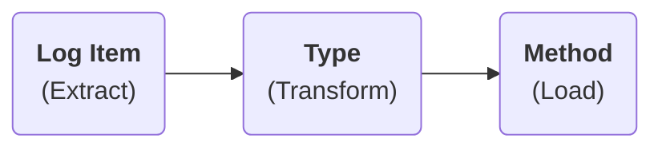

# Overview

There are two aspects to logging in Pode: Types and Methods.

* **Types** define how log items are transformed, and what should be supplied to the Method, such as Error or Request.
* **Methods** define how the transformed log items should be recorded, such as to a file, terminal, or event viewer.

Think of it like an ETL data pipeline:



While we're technically not "extracting" data, the log item is the initial entity/data in the pipeline. After which it is transformed by the Log Type (Error, Request, etc.), and then loaded - or "outputted" - to an appropriate log source like file/etc.

For example when you supply an Exception to [`Write-PodeErrorLog`](../../../Functions/Logging/Write-PodeErrorLog), the Exception passed to Pode's inbuilt Error logging Type which transforms it into a string; which is then passed to a logging Method - like a File or Terminal - to be outputted/recorded.

Pode has several inbuilt logging Methods for you to use:

* [Terminal](../Methods/Terminal)
* [File](../Methods/File)
* [Event Viewer](../Methods/EventViewer)
* [Custom](../Methods/Custom)

As well as some inbuilt logging Types:

* [Error](../Types/Errors)
* [Requests](../Types/Requests)
* [Custom](../Types/Custom)

## Masking Values

When logging items you have the ability to mask sensitive information. This is supported in all inbuilt log Methods by default (except Custom) - it can be supported in Custom methods via [`Protect-PodeLogItem`](../../../Functions/Logging/Protect-PodeLogItem).

Information to mask is determined using regex defined within the `server.psd1` configuration file. You can supply multiple patterns, and even define what the mask is - the default being `********`.

!!! note
    Patterns are case-insensitive.

For example, to mask all password fields that could be logged you could use the following:

```powershell
@{
    Server = @{
        Logging = @{
            Masking = @{
                Patterns = @('Password=\w+')
            }
        }
    }
}
```

This would turn:

```plain
Username, Password=Hunter2, Email
```

into

```plain
Username, ********, Email
```

Instead of masking the whole value that matches, there is support for two regex groups:

* `keep_before`
* `keep_after`

Specifying either of these groups in your pattern will keep the original value in place rather than masking it.

For example, expanding on the above, to keep the `Password=` text you could use the following:

```powershell
@{
    Server = @{
        Logging = @{
            Masking = @{
                Patterns = @('(?<keep_before>Password=)\w+')
            }
        }
    }
}
```

This would turn:

```plain
Username, Password=Hunter2, Email
```

into

```plain
Username, Password=********, Email
```

To specify a custom mask, you can do this in the configuration file:

```powershell
@{
    Server = @{
        Logging = @{
            Masking = @{
                Patterns = @('(?<keep_before>Password=)\w+')
                Mask = '--MASKED--'
            }
        }
    }
}
```

## Batches

By default all log items are recorded one-by-one, but this can obviously become very slow if a lot of log items are being processed.

To help speed this up you can create a batching info object using [`New-PodeLogBatchInfo`](../../../Functions/Logging/New-PodeLogBatchInfo), and supply it to your logging Method:

```powershell
$batchInfo = New-PodeLogBatchInfo -Size 10
New-PodeLogTerminalMethod -BatchInfo $batchInfo | Enable-PodeRequestLogging
```

Instead of writing logs one-by-one, the above will cache transformed log items. Once the appropriate number of cached log items is met (in this case 10), all of the log items will be sent to the log Method at once. This means that the log Method's scriptblock will receive an array of items, rather than a single item.

You can also specify a `-Timeout` value, in seconds, so that if your batch size is 10 but only 5 log items are added, then after the timeout value the log items will be sent to your method regardless the current number of cached log items.
